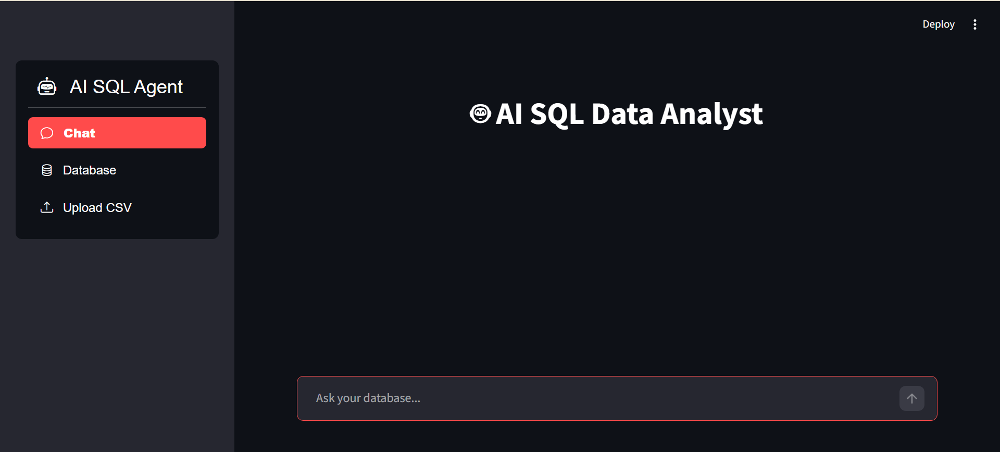
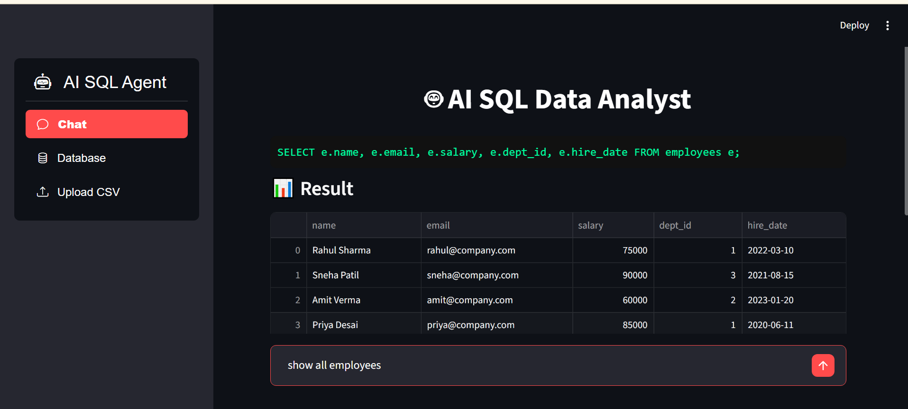
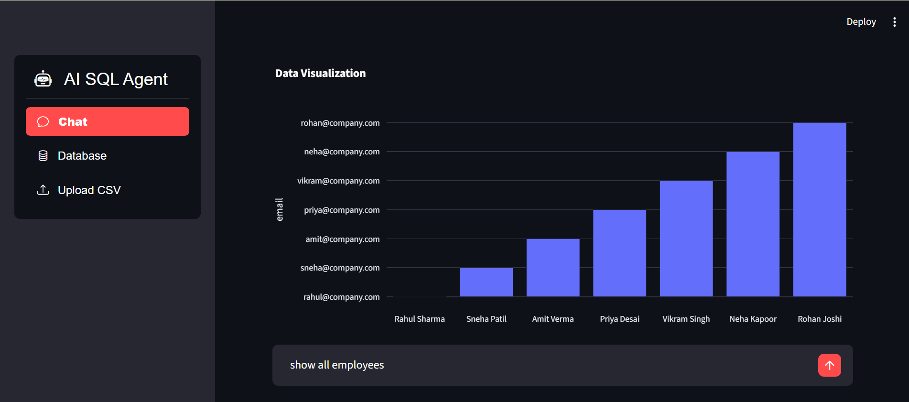

# ai-sql-agent-pro
# 🚀 AI SQL Agent Pro (Groq + Streamlit)

> 🧠 Chat with your database using natural language
> ⚡ Powered by Groq (LLaMA3 - ultra-fast inference)
> 📊 Built with an interactive Streamlit UI

---

## 🌟 Overview

**AI SQL Agent Pro** is an intelligent data assistant that allows users to:

* Ask questions in plain English 💬
* Automatically generate SQL queries 🧠
* Execute queries on a database ⚡
* Visualize results instantly 📊

---

## 🖥️ UI Preview

### 💬 Chat + SQL + Results

* Natural language input
* Generated SQL query preview
* Tabular results display

### 📊 Data Visualization

* Automatic charts based on query results
* Interactive graph rendering

### 📂 Sidebar Navigation

* Chat interface
* Database view
* CSV upload functionality


### 💬 Chat Interface


### 📂 Query Results &  Sidebar & CSV Upload


### 📊 Visualization


---

## 🎯 Features

* 💬 Chat-based database interaction
* 🧠 Natural Language → SQL conversion
* ⚡ Fast inference using Groq API
* 📊 Automatic data visualization
* 🧾 SQL query preview before execution
* 📁 CSV upload → auto database integration
* 🛡️ SQL safety guard (blocks harmful queries)
* 📥 Export results

---

## 🏗️ Architecture

```id="arch2"
User (Streamlit UI)
   ↓
Groq LLM (SQL Generator)
   ↓
SQL Guard (Safety Check)
   ↓
SQL Executor (Database)
   ↓
Results + Charts + Explanation
```

---
##📂 Project Structure

```
ai-sql-agent/
│
├── .env.example
├── requirements.txt
│
├── agent/
│   ├── llm.py
│   ├── sql_executor.py
│   ├── sql_explainer.py
│   ├── sql_generator.py
│   └── sql_guard.py
│
├── app/
│   └── app.py
│
├── config/
│   └── settings.py
│
├── database/
│   ├── connection.py
│   ├── csv_loader.py
│   └── schema.py
│
├── ui/
│   ├── chat_ui.py
│   └── sidebar.py
│
├── uploads/
│
├── utils/
│   ├── charts.py
│   └── ui_theme.py
│
├── assets/                     # 🔥 UI images for README
│   ├── ui.png
│   ├── ui2.png
│   └── ui3.png
│
└── README.md

```

---

## ⚙️ System Requirements

* Python **3.9+**
* RAM: **4GB minimum (8GB recommended)**
* OS: Windows / Linux / Mac
* Groq API key

---

## 🔧 Installation & Setup

---

### 🥇 Step 1: Clone Repo

```bash id="clone2"
git clone https://github.com/vivekpatil03/ai-sql-agent-pro.git
cd ai-sql-agent-pro
```

---

### 🥈 Step 2: Create Virtual Environment

```bash id="venv2"
python -m venv venv
```

Activate:

**Windows**

```bash id="win2"
venv\Scripts\activate
```

**Mac/Linux**

```bash id="mac2"
source venv/bin/activate
```

---

### 🥉 Step 3: Install Dependencies

```bash id="install2"
pip install --upgrade pip
pip install -r requirements.txt
```

---

### 🏅 Step 4: Setup Environment Variables

Create `.env` file:

```env id="env2"
GROQ_API_KEY=your_groq_api_key_here
DB_URL=sqlite:///database.db
👉 Get Groq API key from: https://console.groq.com/
```

---

### 🏁 Step 5: Run Application

```bash id="run2"
streamlit run app/app.py
```

Open in browser:

```id="url2"
http://localhost:8501
```

---

## 💡 How to Use

---

### 💬 1. Ask Questions

Example:

```id="ex1"
show all projects
```

---

### 🧠 2. AI Generates SQL

```id="ex2"
SELECT p.project_name, p.budget FROM projects p;
```

---

### 📊 3. View Results

* Table displayed instantly
* Clean structured output

---

### 📈 4. Visualize Data

* Charts generated automatically
* Helps quick insights

---

### 📁 5. Upload CSV

* Use sidebar → Upload CSV
* Automatically available for querying

---

## 🛡️ Security Layer

The system blocks dangerous SQL queries like:

* ❌ DROP TABLE
* ❌ DELETE
* ❌ TRUNCATE

---

## 📊 Visualization Support

The app automatically generates:

* 📊 Bar charts
* 📈 Trend graphs
* 📉 Data comparisons

---
## 🤝 Contributing

```bash id="git2"
git checkout -b feature-name
git commit -m "Added feature"
git push origin feature-name
```

---

## 📜 License

MIT License

---

## ⭐ Support

If you like this project:

👉 Star the repo
👉 Share with others

---


